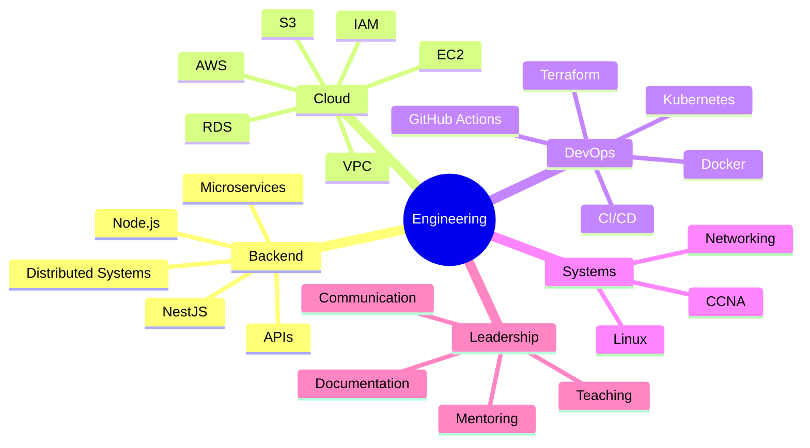
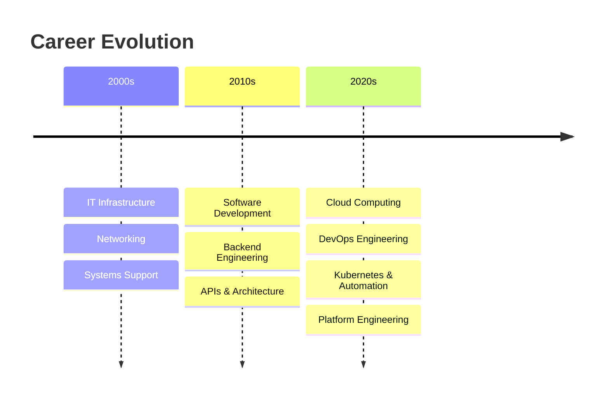

<div align="center">

#  Hello World | Olá Mundo | こんにちは

# Backend Engineer → Cloud & DevOps Engineer


## Senior Backend Engineer | Cloud & DevOps Engineer | IT & Cisco Academy Instructor


</div>

---

# 🌎 About Me

## 🇺🇸 English

Backend Engineer with **20+ years of experience in Information Technology**, specializing in scalable backend systems, cloud infrastructure, distributed architectures, and DevOps engineering.

Currently focused on transitioning into high-level **Cloud & DevOps Engineering**, building production-style environments using:

- AWS Cloud Architecture
- Terraform (Infrastructure as Code)
- Docker & Kubernetes
- CI/CD Automation
- GitHub Actions
- Linux Infrastructure
- Distributed Systems Design
- Platform Engineering Concepts

Strong background in:
- Backend Engineering with Node.js & NestJS
- API Design & Microservices
- Infrastructure Automation
- System Reliability
- Software Engineering Best Practices

In parallel, I work as an **IT Instructor and Cisco Academy Instructor**, teaching programming, networking, infrastructure fundamentals, and cloud concepts — strengthening leadership, communication, mentoring, and technical documentation skills.

Targeting opportunities in:
- DevOps Engineering
- Cloud Engineering
- Platform Engineering
- Site Reliability Engineering (SRE)
- Infrastructure Automation
- Backend Infrastructure

---

## 🇧🇷 Português

Engenheiro Backend com **mais de 20 anos de experiência em Tecnologia da Informação**, especializado em sistemas escaláveis, infraestrutura cloud, arquiteturas distribuídas e engenharia DevOps.

Atualmente focado em transição e especialização em:
- Cloud Computing
- DevOps
- Kubernetes
- Terraform
- AWS
- Automação de infraestrutura
- CI/CD
- Arquitetura de sistemas distribuídos

Experiência sólida em:
- Node.js & NestJS
- APIs REST
- Microsserviços
- Linux
- Infraestrutura como Código (IaC)
- Engenharia de Software

Também atuo como **Instrutor de TI e Instrutor Cisco Academy**, ensinando programação, infraestrutura, redes e fundamentos cloud.

---

## 🇯🇵 日本語

<ruby>私<rt>わたし</rt></ruby>は20<ruby>年以上<rt>ねんいじょう</rt></ruby>のIT<ruby>経験<rt>けいけん</rt></ruby>を<ruby>持<rt>も</rt></ruby>つバックエンドエンジニアです。

Node.js と NestJS で スケーラブルな システム と API を <ruby>開発<rt>かいはつ</rt></ruby>しています。

<ruby>現在<rt>げんざい</rt></ruby>は Cloud と DevOps を <ruby>勉強<rt>べんきょう</rt></ruby>しています。

AWS、Terraform、Docker、Kubernetes、CI/CD を <ruby>使<rt>つか</rt></ruby>って <ruby>実践的<rt>じっせんてき</rt></ruby>な プロジェクト を <ruby>作<rt>つく</rt></ruby>っています。

また、IT と Cisco Academy の <ruby>先生<rt>せんせい</rt></ruby>として プログラミング、ネットワーク、インフラ を <ruby>教<rt>おし</rt></ruby>えています。

DevOps Engineer と Cloud Engineer の ポジション を <ruby>目指<rt>めざ</rt></ruby>しています。

---

# 🧠 Core Competencies | Competências Essenciais



---

# 🛠️ Tech Stack

## 🚀 Backend


---

## ☁️ Cloud & DevOps


---

## 🖥️ Systems & Infrastructure


---

## 🌐 Frontend


---

# 📈 Engineering Growth Path | Trilha de Crescimento na Engenharia



---

# 🎯 Current Focus | Foco Atual

- Cloud-Native Infrastructure
- DevOps Engineering
- Kubernetes Administration
- Infrastructure Automation
- AWS Architecture
- CI/CD Pipelines
- Observability & Reliability
- Scalable Distributed Systems
- Platform Engineering
- SRE Concepts

---

# 🏆 Professional Differentials | Diferenciais Profissional

| En | Pt-br |
|---|---|
| ✅ 20+ Years in IT | Mais de 20 anos na área de TI |
| ✅ Backend + Infrastructure Hybrid Profile  | Perfil híbrido de backend e infraestrutura |
| ✅ Strong Networking Foundation (CCNA-level) | Sólida base em redes (nível CCNA) |
| ✅ IT & Cisco Academy Instructor | Instrutor da Academia de TI e Cisco |
| ✅ Experience Explaining Complex Technical Concepts | Experiência em explicar conceitos técnicos complexos | 
| ✅ Engineering-Driven Learning Approach | Abordagem de aprendizagem orientada para a engenharia |
| ✅ Hands-on Real-World Projects | Projetos práticos no mundo real |
| ✅ Continuous Learning Mindset | Mentalidade de aprendizagem contínua |

---

# 🌍 Languages | Idiomas

| Language | Level |
|---|---|
| &#127482;&#127480; English | Professional |
| &#127463;&#127479; Portuguese | Native |
| &#127471;&#127477; Japanese | Intermediate (JLPT N3 Path) |

---

# 📚 Currently Learning | Aprendendo Atualmente

```txt
AWS Advanced Architectures
Kubernetes Administration
Platform Engineering
Infrastructure Automation
Cloud Security Fundamentals
Site Reliability Engineering (SRE)
Japanese Language (JLPT Path)
```

---

# 📫 Connect With Me | Conecte-se comigo

<div align="center">

[](https://linkedin.com/in/profalexandretolentino)
[](https://github.com/profalexandretolentino)
[](https://instagram.com/profalexandretolentino)
[](https://#)

</div>

---

# 💬 Wisdom | Citação

> "Quem ensina aprende ao ensinar. E quem aprende ensina ao aprender."  
> — Paulo Freire (Brazilian Educator & Philosopher)

> "He who teaches learns in the act of teaching, and he who learns teaches in the act of learning."

> 「<ruby>教<rt>おし</rt></ruby>える<ruby>者<rt>もの</rt></ruby>は<ruby>教<rt>おし</rt></ruby>える<ruby>過程<rt>かてい</rt></ruby>で<ruby>学<rt>まな</rt></ruby>び、<ruby>学<rt>まな</rt></ruby>ぶ<ruby>者<rt>もの</rt></ruby>は<ruby>学<rt>まな</rt></ruby>ぶ<ruby>過程<rt>かてい</rt></ruby>で<ruby>教<rt>おし</rt></ruby>える。」

---

<div align="center">

### ⚡ Building scalable systems, automating infrastructure, and evolving toward high-level Cloud & DevOps Engineering. <br><br> ⚡ Construir sistemas escaláveis, automatizar infraestrutura e evoluir rumo à Engenharia de Nuvem e DevOps de alto nível.

</div>